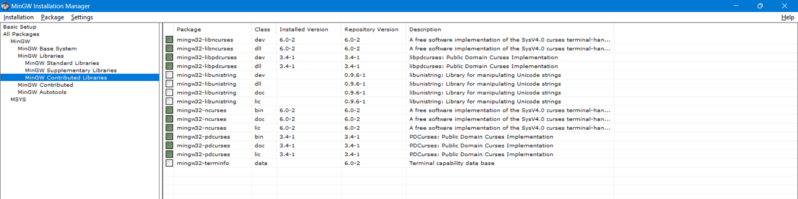
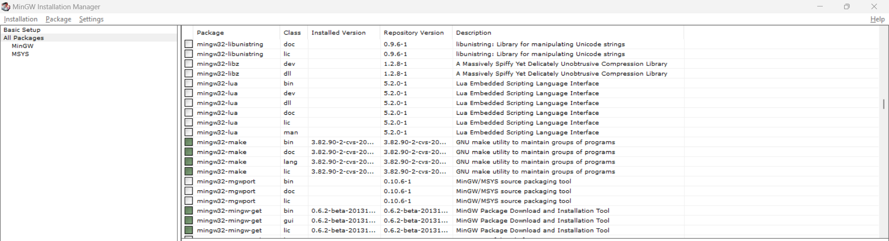

# sl-on-windows

## made some changes to be able to run sl on powershell

1. Install MinGW for C/C++
2. Install curses for windows and mingw32-make for windows through mingw

   
   

3. copy the sl.c , sl.h , makefile

4. ```
   mingw32-make
   ```
   then
   ```
   ./sl
   ```

# SL(1): Cure your bad habit of mistyping

SL (Steam Locomotive) runs across your terminal when you type "sl" as
you meant to type "ls". It's just a joke command, and not useful at
all.

Copyright 1993,1998,2014 Toyoda Masashi (mtoyoda@acm.org)


